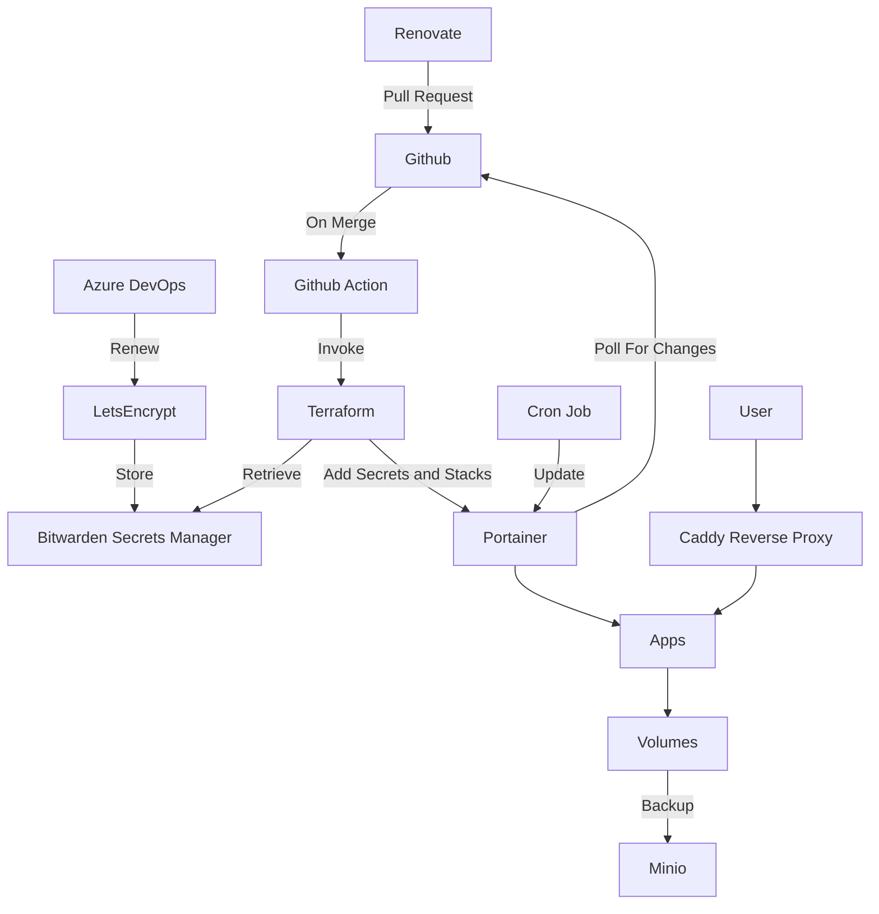

# monitoring-lab
Homelab monitoring configuration

## Diagram



## Port mappings

| Host port | Stack | Usage | Protocol |
| --- | --- | --- | --- |
| 5044 | Graylog | ? | ? |
| 5140 | Graylog | ? | TCP/UDP |
| 9000 | Graylog | Web UI | HTTP | 
| 9443 | Portainer | Web UI | HTTPS |
| 12201 | Graylog | ? | ? |
| 13301 | Graylog | ? | ? | 
| 13302 | Graylog | ? | ? |
| 20211 | NetAlertX | WebUI | HTTP |

## Deployment

### Manual with Task

- Create `.env` file in the root of the repository (or somewhere else, and update the path in `Taskfile.yml`)
- Populate required variables
- Run `task up` in a folder, or `task all-up` in the repository to deploy service(s) 

### GitOps with Portainer

- Copy `docker-compose.yml` to target host (into a folder called `portainer`)
- Run `docker compose up -d`, then complete initial configuration on `https://<server>:9443`
- Set environment variables
```sh
export PORTAINER_ENDPOINT="https://<server>:9443_API_KEY"
export PORTAINER_API_KEY="<portainer-api-key>"
export PORTAINER_SKIP_SSL_VERIFY=true
export BW_ACCESS_TOKEN="<bitwarden-token>"
export BW_ORGANIZATION_ID="<bitwarden-org-id>"
export TF_TOKEN_app_terraform_io="<terraform-cloud-team-token>"
```
- `cd terraform`
- `terraform init`
- `terraform apply`
- Any repository changes can be automatically synced by Portainer (including updates pushed by Renovate)
scp 
### Minimal Host

I'm using Alpine Linux as the host for this deployment, because it is very small and lightweight (and my monitoring hardware is an old Dell ThinClient with a 32GB SSD module in).

### Install and enable Docker

```sh
apk add docker docker-compose
apk addgroup <user> docker
nano /etc/rc.conf # uncomment rc_cgroup_mode="unified"
rc-update add cgroups
rc-update add docker boot
reboot
```

### Enable Docker Swarm (required for using secrets)

```sh
docker swarm init
```

### Mount USB for data storage

- Partition the USB as ext4 with label `data`
- `mkdir /data`
- `chown root:docker /data`
- `echo "LABEL=data /data ext4 rw,user,nofail 0 0" >> /etc/fstab`
- `mount -a`
```

## Tools

### Graylog

TBC

### NetAlertX

- Open web UI and update configuration
    - set password if required
    - set cidr range and interface for SCAN_SUBNETS
    - configure notification sender

### Portainer

TBC