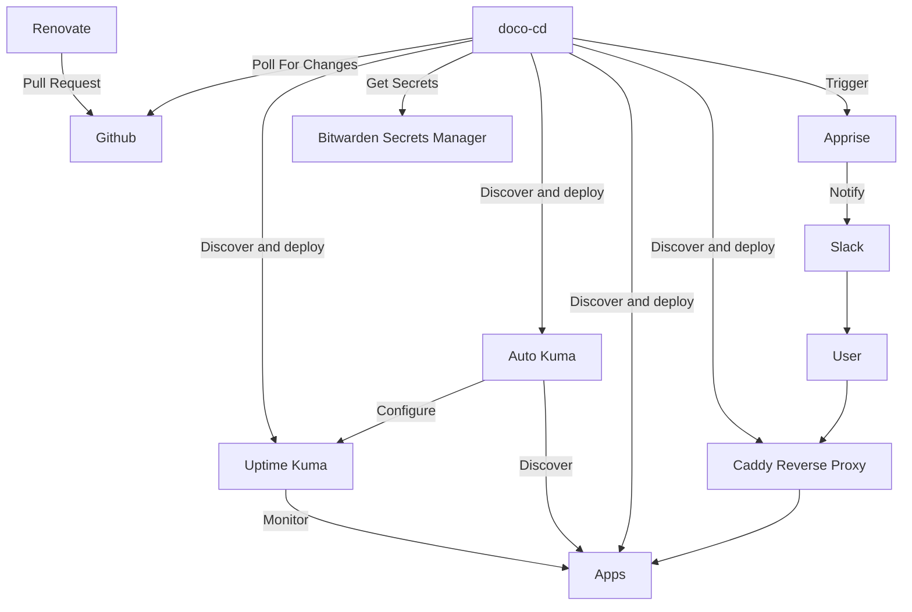

# monitoring-lab

Homelab monitoring configuration using `doco-cd` and `renovate`, with automated discovery

## Diagram



## Deployment

- Clone repository to host
- Create `.env` file
- Run `docker compose up --env-file ../.env --detach` in `/doco-cd`

### Env file

```
TBD - bitwarden and slack secrets
```

### Port mappings

| Host port | Stack | Usage | Protocol |
| --- | --- | --- | --- |
| 20211 | NetAlertX | WebUI | HTTP |
<!-- | 5044 | Graylog | ? | ? |
| 5140 | Graylog | ? | TCP/UDP |
| 9000 | Graylog | Web UI | HTTP | 
| 9443 | Portainer | Web UI | HTTPS |
| 12201 | Graylog | ? | ? |
| 13301 | Graylog | ? | ? | 
| 13302 | Graylog | ? | ? | -->

### Minimal Host

I'm using Alpine Linux as the host for this deployment, because it is very small and lightweight (and my monitoring hardware is an old Dell ThinClient with a 32GB SSD module in).

### Install and enable Docker

```sh
apk add docker docker-compose
apk addgroup <user> docker
nano /etc/rc.conf # uncomment rc_cgroup_mode="unified"
rc-update add cgroups
rc-update add docker boot
reboot
```

### Mount USB for data storage

- Partition the USB as ext4 with label `data`
- `mkdir /data`
- `chown root:docker /data`
- `echo "LABEL=data /data ext4 rw,user,nofail 0 0" >> /etc/fstab`
- `mount -a`
- `sudo service docker stop`
- `sudo mkdir /etc/docker`
- `sudo nano /etc/docker/daemon.json`:
```json
{
  "data-root": "/data/docker"
}
```
- `sudo mv /var/lib/docker /data`
- `sudo service docker start`

## Tools

### Graylog

TBC

### NetAlertX

- Open web UI and update configuration
    - set password if required
    - set cidr range and interface for SCAN_SUBNETS
    - configure notification sender
